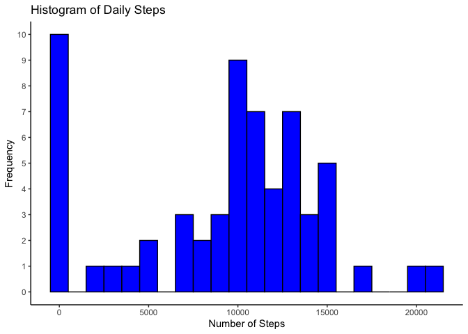
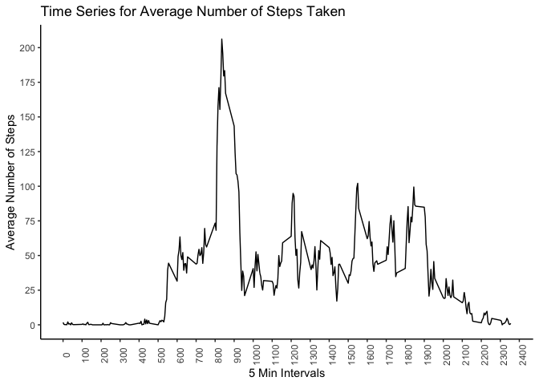
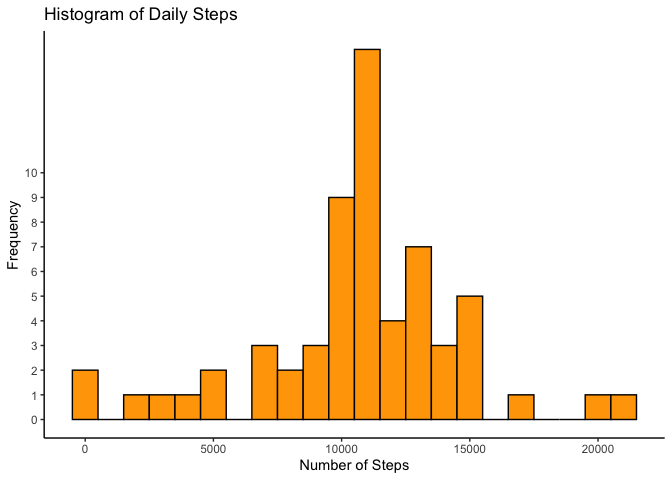
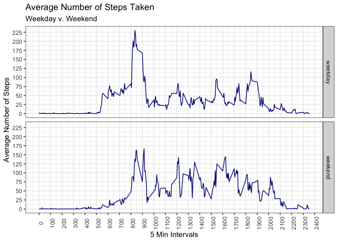

Setting echo = TRUE for all code chunks. Loading packages that will be utilized. 

```r
knitr::opts_chunk$set(echo = TRUE)

library(dplyr)
```

```
## 
## Attaching package: 'dplyr'
```

```
## The following objects are masked from 'package:stats':
## 
##     filter, lag
```

```
## The following objects are masked from 'package:base':
## 
##     intersect, setdiff, setequal, union
```

```r
library(tidyr)
library(ggplot2)
```

## Loading and preprocessing the data

Reading in data and converting date variable to be in date format

```r
activity <- read.csv("activity.csv", na.strings = "NA")
activity$date <- as.Date(activity$date, format = "%Y-%m-%d")
```


## What is mean total number of steps taken per day?

Total number of steps taken per day

```r
totalSteps <- activity %>%
    group_by(date) %>%
    summarise(total = sum(steps, na.rm = TRUE))

print.data.frame(totalSteps)
```

```
##          date total
## 1  2012-10-01     0
## 2  2012-10-02   126
## 3  2012-10-03 11352
## 4  2012-10-04 12116
## 5  2012-10-05 13294
## 6  2012-10-06 15420
## 7  2012-10-07 11015
## 8  2012-10-08     0
## 9  2012-10-09 12811
## 10 2012-10-10  9900
## 11 2012-10-11 10304
## 12 2012-10-12 17382
## 13 2012-10-13 12426
## 14 2012-10-14 15098
## 15 2012-10-15 10139
## 16 2012-10-16 15084
## 17 2012-10-17 13452
## 18 2012-10-18 10056
## 19 2012-10-19 11829
## 20 2012-10-20 10395
## 21 2012-10-21  8821
## 22 2012-10-22 13460
## 23 2012-10-23  8918
## 24 2012-10-24  8355
## 25 2012-10-25  2492
## 26 2012-10-26  6778
## 27 2012-10-27 10119
## 28 2012-10-28 11458
## 29 2012-10-29  5018
## 30 2012-10-30  9819
## 31 2012-10-31 15414
## 32 2012-11-01     0
## 33 2012-11-02 10600
## 34 2012-11-03 10571
## 35 2012-11-04     0
## 36 2012-11-05 10439
## 37 2012-11-06  8334
## 38 2012-11-07 12883
## 39 2012-11-08  3219
## 40 2012-11-09     0
## 41 2012-11-10     0
## 42 2012-11-11 12608
## 43 2012-11-12 10765
## 44 2012-11-13  7336
## 45 2012-11-14     0
## 46 2012-11-15    41
## 47 2012-11-16  5441
## 48 2012-11-17 14339
## 49 2012-11-18 15110
## 50 2012-11-19  8841
## 51 2012-11-20  4472
## 52 2012-11-21 12787
## 53 2012-11-22 20427
## 54 2012-11-23 21194
## 55 2012-11-24 14478
## 56 2012-11-25 11834
## 57 2012-11-26 11162
## 58 2012-11-27 13646
## 59 2012-11-28 10183
## 60 2012-11-29  7047
## 61 2012-11-30     0
```

Histogram of total number of steps taken per day 

```r
ggplot(totalSteps, aes(total)) +
    geom_histogram(binwidth = 1000, fill = "blue", color = "black") +
    scale_y_continuous(breaks = seq(0,10, by = 1)) +
    labs(title = "Histogram of Daily Steps", x = "Number of Steps", y = "Frequency") +
    theme_classic()
```

<!-- -->

Calculating Mean and Median of the total number of steps taken per day 

```r
summary(totalSteps$total, na.rm = TRUE)
```

```
##    Min. 1st Qu.  Median    Mean 3rd Qu.    Max. 
##       0    6778   10395    9354   12811   21194
```


## What is the average daily activity pattern?

Calculating the average steps taken at each 5 minute interval

```r
avgSteps <- activity %>%
    group_by(interval) %>%
    summarise(mean = mean(steps, na.rm = TRUE))

head(avgSteps)
```

```
## # A tibble: 6 × 2
##   interval   mean
##      <int>  <dbl>
## 1        0 1.72  
## 2        5 0.340 
## 3       10 0.132 
## 4       15 0.151 
## 5       20 0.0755
## 6       25 2.09
```

Creating a time series of the average number of steps taken at each interval

```r
ggplot(avgSteps, aes(x = interval, y = mean)) +
    geom_line() +
    scale_x_continuous(breaks = seq(0,2400, by = 100)) +
    scale_y_continuous(breaks = seq(0, 225, by = 25)) +
    labs(title = "Time Series for Average Number of Steps Taken", 
         x = "5 Min Intervals", y = "Average Number of Steps") +
    theme_classic() +
    theme(axis.text.x = element_text(angle = 90)) 
```

<!-- -->


## Imputing missing values

Total number of missing values

```r
sum(is.na(activity$steps))
```

```
## [1] 2304
```

Creating a new data set replacing missing values in the original data with the mean for that specific 5-minute interval.

```r
new <- activity %>%
    inner_join(avgSteps, by = "interval") %>%
    mutate(steps = coalesce(steps, mean)) %>%
    select(-mean)
```

Creating Histogram and calculating Mean and Median of new data set.  By replacing missing values with the mean for that specific 5-minute interval, that data has become a more normal distribution.  The Mean and Median have increased from the original data set. 

```r
totalStepsNew <- new %>%
    group_by(date) %>%
    summarise(total = sum(steps, na.rm = TRUE))

ggplot(totalStepsNew, aes(total)) +
    geom_histogram(binwidth = 1000, fill = "orange", color = "black") +
    scale_y_continuous(breaks = seq(0,10, by = 1)) +
    labs(title = "Histogram of Daily Steps", x = "Number of Steps", y = "Frequency") +
    theme_classic()
```

<!-- -->

```r
summary(totalStepsNew$total, na.rm = TRUE)
```

```
##    Min. 1st Qu.  Median    Mean 3rd Qu.    Max. 
##      41    9819   10766   10766   12811   21194
```


## Are there differences in activity patterns between weekdays and weekends?

Creating new variable "week" showing whether given date is a weekday or weekend 

```r
new$week <- weekdays(new$date, abbreviate = TRUE)
new$week <- ifelse(new$week %in% c("Sat", "Sun"), "weekend", "weekday")
```

Calculating the average steps taken at each 5 minute interval for weekday and weekend 

```r
avgWeek <- new %>%
    group_by(week, interval) %>%
    summarise(mean = mean(steps, na.rm = TRUE))
```

```
## `summarise()` has grouped output by 'week'. You can override using the
## `.groups` argument.
```

Creating panel plot showing the difference between the average steps taken on weekdays and weekends.  Overall it appears the average steps taken on the weekend are lower than weekdays.  In regards to the 5 minute intervals, the weekday has more steps taken in the morning hours where as steps taken on weekends are more evenly distributed.   

```r
ggplot(avgWeek) +
    geom_line(aes(x = interval, y = mean), color = "dark blue") + 
    facet_grid(vars(week)) +
    scale_x_continuous(breaks = seq(0,2400, by = 100)) +
    scale_y_continuous(breaks = seq(0, 225, by = 25)) +
    labs(title = "Average Number of Steps Taken", subtitle = "Weekday v. Weekend",
         x = "5 Min Intervals", y = "Average Number of Steps") +
    theme_bw() +
    theme(axis.text.x = element_text(angle = 90))
```

<!-- -->

